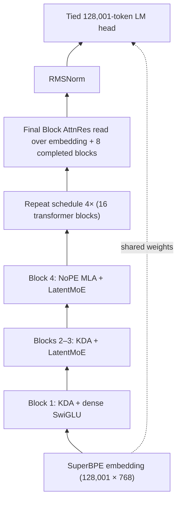

# K3-Inspired Mini-Pretraining System

This repository implements a text-only, public-faithful approximation of the pictured Kimi K3
architecture. It composes the published Kimi Delta Attention (KDA), NoPE MLA, Block Attention
Residuals, and LatentMoE designs without inventing the equations of unreleased K3 components.

The primary JSON profile contains 445,227,336 total parameters and an estimated 179,806,536 active
parameters per token. It has a tied 128,001-token embedding/head, width 768, 16 layers, a repeating
`KDA, KDA, KDA, NoPE MLA` schedule, and a dense first FFN followed by 15 LatentMoE FFNs.



Each attention and FFN output is one AttnRes sublayer. Four sublayers are summed into one AttnRes
block, so 32 sublayers produce eight completed blocks plus the embedding source. Every pseudo-query
is zero-initialized.

## What is implemented

| Component | macOS/CPU/MPS | H100 |
|---|---|---|
| KDA | exact recurrent FP32-state oracle | FLA `chunk_kda`, fused Q/K norm, decay gate, beta, backward |
| KDA short convolution | causal PyTorch depthwise convolution | FLA Triton `ShortConvolution` |
| NoPE MLA | PyTorch SDPA | SDPA FlashAttention backend |
| Block AttnRes | readable depth softmax | FLA fused AttnRes + output RMSNorm, checkpoint level 1 |
| Routed expert MLP | Python expert loop over stacked weights | Selectable MegaBlocks or SonicMoE bitmatrix metadata + QuACK grouped GEMM |
| Dense/shared FFNs | PyTorch SwiGLU | BF16 default or TE 2.16 `Float8CurrentScaling`; gate/up share one FP8 GEMM |
| LM loss | PyTorch cross-entropy | Liger BF16 default or chunked TE Current Scaling FP8 + Liger/QuACK CE; full 128K logits are omitted |
| Router | softmax top-4 with balance/z losses; sigmoid no-aux ablation | same |

The default softmax router uses a `0.01` load-balancing coefficient and `0.001` z-loss coefficient.
The selectable `sigmoid_noaux` router uses unbiased mixture weights, selection-only correction bias,
and a `1e-3` correction update. Training logs per-layer expert loads, entropy, dead experts, maximum
load violation, and the longest current dead-expert streak.

K3's Gated MLA, Quantile Balancing, SiTU, Stable LatentMoE changes, QAT, and vision stack are not
implemented because their equations are not public. The relevant modules are isolated behind
interfaces so a published implementation can replace them later.

## Install

The project requires Python 3.11 or 3.12 and is locked with `uv`.

macOS development:

```bash
uv sync --locked
uv run pytest
uv run python test_smoke.py
```

Linux/H100:

```bash
uv sync --locked --extra cuda
uv run k3-mini dry-run --config configs/primary.json --backend h100
uv run k3-mini train --config configs/h100-smoke.json --synthetic
```

The CUDA extra pins these inspected revisions:

- `fla-org/flash-linear-attention@ccb0ff944cbff035fa59ac47a4cc8fd2e079bb17`
- `databricks/megablocks@952db33d6eac334d22c61e47a0d5d41446298784`
- `linkedin/Liger-Kernel@72a4ed47a5c593b58045a0af14d3f774a037bd92`
- `transformer-engine[pytorch]==2.16.0`

`uv` supplies Torch as an explicit build dependency for MegaBlocks and `grouped_gemm`, and sets
`GROUPED_GEMM_CUTLASS=1` specifically for the latter so expert counts can remain CUDA-resident.
Both packages are guarded by Linux x86-64 markers and are not installed into the macOS environment.
Record `nvidia-smi`, driver, CUDA toolkit, GPU model, and the successful backend report when the
target SSH host is available.

QuACK 0.6.1 requires Python 3.12 and a CUDA 12.9+ toolkit. Its CUDA-13 CuTe DSL dependencies are
kept in an isolated target so they cannot perturb the locked Torch/FLA/MegaBlocks environment:

```bash
scripts/install_quack_isolated.sh
scripts/run_with_quack.sh \
  env K3MINI_RUN_GPU_TESTS=1 .venv/bin/pytest -m gpu tests/test_h100_parity.py
scripts/run_with_quack.sh \
  .venv/bin/python scripts/profile_h100_step.py \
    --config configs/h100-fp8-current-quack.json --warmup 2 --repeats 5
```

The installer uses exact package versions and `uv pip --target --no-deps`. This is deliberately
different from asking `uv` to resolve QuACK's CUDA-13 extra inside the training environment; the
upstream README warns that dependency installation order matters for that path.

SonicMoE is also isolated because its current source metadata requires a newer Torch release than
the pinned training stack. The installer combines pinned SonicMoE `0349404` and QuACK 0.6.1 in one
target without changing the locked environment:

```bash
scripts/install_sonic_isolated.sh
scripts/run_with_sonic.sh \
  env K3MINI_RUN_GPU_TESTS=1 .venv/bin/pytest -m gpu tests/test_h100_parity.py
scripts/run_with_sonic.sh \
  .venv/bin/python scripts/profile_h100_step.py \
    --config configs/h100-fp8-current-quack-sonic.json --warmup 2 --repeats 5
```

This exact-pinned BF16 path passes on Torch 2.7 with a small import-only FP4 dtype sentinel; it does
not exercise Sonic's FP8/FP4 branches. The adapter deliberately uses Sonic's fixed-top-k internal
primitives, so the pin must be updated together with the adapter and its CUDA parity tests.

## Configuration and commands

The commands consume a JSON file containing typed `model`, `data`, and `train` sections:

```bash
uv run k3-mini dry-run --config configs/primary.json
uv run k3-mini data-inspection --config configs/primary.json --samples 2
uv run k3-mini make-validation --config configs/primary.json
uv run k3-mini train --config configs/primary.json --stage overfit
uv run k3-mini train --config configs/primary.json --stage 10m
uv run torchrun --standalone --nproc_per_node=8 \
  -m k3mini.cli train --config configs/primary.json --stage 1b
```

Resume with the same world size:

```bash
uv run torchrun --standalone --nproc_per_node=8 \
  -m k3mini.cli train --config configs/primary.json --stage 1b --resume latest
```

`--stage overfit` repeats one fixed global batch for 100 updates. `--stage 10m` stops after crossing
10M consumed tokens. `--stage 1b` uses the configured 1B-token target. `--synthetic` replaces
ClimbMix with deterministic random tokens for plumbing tests only.

The default global batch is 262,144 tokens. With one 4,096-token sequence per GPU, gradient
accumulation is derived as `64 / world_size`, which is integral for one through eight GPUs.

## Data path and exact resume

`PackedClimbMixDataset`:

1. opens `OptimalScale/ClimbMix` as a Hugging Face streaming iterable;
2. deterministically shuffles its data sources and a bounded 10,000-row buffer;
3. shards the iterable by DDP rank;
4. consumes only `text` for training and retains `cluster_id` counts for diagnostics;
5. ignores ClimbMix's floating-point, tokenizer-specific `token_count`;
6. hashes documents into a deterministic 0.1% validation split;
7. calls the Rust `tokenizers.Tokenizer.encode_batch` path directly;
8. inserts token 128000 (`<|endoftext|>`) after each document; and
9. emits contiguous 4,097-token chunks as shifted 4,096-token samples without padding.

The validation command materializes only one million validation tokens. A checkpoint contains a
single shared model/optimizer state plus a small rank-local file with Hugging Face iterable state,
the rolling token buffer, RNG state, cluster counters, and resolved tokenizer/dataset commit IDs.
Writes use temporary files followed by atomic replacement and a final `COMPLETE` marker. Exact
resume rejects a changed world size or revision.

## Training defaults

- DDP over one to eight H100s; no expert parallelism.
- BF16 autocast with FP32 parameters and AdamW state; TF32 enabled.
- Optional TE Current Scaling FP8 for eligible dense/latent FFN and LM-head GEMMs; attention,
  routers, routed experts, parameters, and optimizer state remain BF16/FP32 as appropriate.
- Activation recomputation for AttnRes/mixer and AttnRes/FFN sublayers.
- AdamW: LR `3e-4`, betas `(0.9, 0.95)`, epsilon `1e-8`, weight decay `0.1`, clip `1.0`.
- No weight decay on norms, biases, KDA decay parameters, or router correction state.
- A 100-update token-based warmup, then cosine decay to `3e-5`.
- Validation every 25M consumed tokens and atomic checkpoints every 50M.

## Profiling and H100 acceptance

Run a full-step and component benchmark:

```bash
uv run k3-mini kernel-benchmark \
  --config configs/primary.json \
  --backend h100 \
  --iterations 10 \
  --trace runs/k3-mini/h100-trace.json \
  --output runs/k3-mini/h100-benchmark.json
```

The report includes the selected KDA, short-convolution, AttnRes, expert, and loss backends; full
step latency; tokens/second; peak CUDA memory; and forward/backward timings for KDA, MLA, LatentMoE,
and nine-source AttnRes.

The H100 expert path keeps routing metadata on-device: MegaBlocks sort/histogram/gather/scatter
kernels perform permutation and unpermutation, CUTLASS grouped GEMM consumes CUDA-resident expert
counts, gate/up projections share one grouped GEMM, and selected router weights are applied to the
SwiGLU activation before the down projection. The KDA output also uses FLA's fused RMSNorm plus
sigmoid gate. Expensive expert-load diagnostics are evaluated only when the trainer logs.

The first verified H100 result for the earlier untied 543M profile is committed in
[`profiles/h100-sm90-2026-07-17.json`](profiles/h100-sm90-2026-07-17.json). On one H100 80GB, the
untied profile measured 366.0 ms and 11,192 tokens/s for a batch of one 4,096-token sequence,
with 4.90GB peak allocated for model forward/backward.

The tied 445M profile and routed-kernel before/after measurements are in
[`profiles/h100-sm90-tied-optimized.json`](profiles/h100-sm90-tied-optimized.json). The optimized
path measured 236.6 ms and 17,313 tokens/s, versus 316.2 ms and 12,952 tokens/s before the routed
changes: 25.2% lower full-step latency, 33.7% higher throughput, and 54.1% lower LatentMoE
forward/backward latency. This is batch one at 4,096 context with one forward/backward microstep,
activation checkpointing, no gradient accumulation, and no `torch.compile`; AdamW and data loading
are excluded.

The KDA, AttnRes, and routed-MoE components can each be captured by a CUDA Graph. The default BF16
Liger loss computes the non-ignored target count through a host scalar read. The FP8 Current
Scaling loss avoids that read because this data pipeline emits fixed, unpadded samples, but a full
train-step CUDA Graph is still disabled pending DDP and optimizer replay tests.

For one H100, the measured maximum-throughput layout for the planned 262,144-token global batch is
64 sequences per 4,096-token microstep with one accumulation step. The CUDA-synchronized training
entry point sustains 74,093 tokens/second over four post-compilation synthetic AdamW updates,
without `torch.compile`; the isolated CUDA-event update harness measured a conservative 64,492
tokens/second. The earlier FLA capacity probe reached batch 71 with the expandable CUDA allocator,
but it was slower and changes the global batch; batch 72 OOMed at the FLA fused-loss allocation
boundary. Full pre-Liger measurements are in
[`profiles/h100-sm90-max-batch-2026-07-17.json`](profiles/h100-sm90-max-batch-2026-07-17.json).

The same batch-64 layout was also tested with `torch.compile`. With the current Liger loss it
measured 82,968 tokens/second versus 82,899 eager, a statistically neutral `+0.08%` change.
Liger is kept behind an explicit compiler boundary; tracing its 128-chunk Python loop retained
enough 128K-logit intermediates to OOM at 77.13GiB. The fused external kernels already dominate
this profile, so eager remains the default. A reproducible compiled configuration is provided at
[`configs/h100-batch64-compiled.json`](configs/h100-batch64-compiled.json).

The earlier FLA eager Nsight Systems and GH100 hardware-counter capture at the same batch-64 layout
attributes 47.4% of GPU kernel time to the fused 128K-vocabulary LM-head/cross-entropy path, 17.1%
to KDA including its convolution and fused norm/gate, 10.5% to generic elementwise/copy kernels,
and at least 8.0% to routed MoE. The GPU is active 97.9% of the step, but tensor-pipe activity
averages only 18.6% and SM throughput 32.2%; this is a low-occupancy mixed workload rather than a
data-loader stall. See
[`profiles/h100-sm90-eager-bottlenecks-2026-07-17.json`](profiles/h100-sm90-eager-bottlenecks-2026-07-17.json)
for the complete pre-Liger kernel and counter breakdown. The capture can be reproduced with
[`scripts/profile_h100_step.py`](scripts/profile_h100_step.py).

Replacing FLA's fused loss with the pinned
[Liger fused linear cross-entropy](https://github.com/linkedin/Liger-Kernel/blob/72a4ed47a5c593b58045a0af14d3f774a037bd92/src/liger_kernel/ops/fused_linear_cross_entropy.py)
reduced isolated loss latency by 20.9% and peak allocation by 88.7%. The full eager Nsight step
improved from 73,981 to 82,739 tokens/second (`+11.8%`) while peak allocated memory fell from
42.40GiB to 35.06GiB. Its three BF16 LM-head GEMM families plus in-place CE kernel now consume
41.3% of GPU kernel time, so the 128K head remains the largest optimization target.

Transformer Engine 2.16 GroupedLinear was also tested for the 64 routed experts. It was 7.2%
faster than MegaBlocks in an isolated 1,048,576-row expert forward/backward, but the complete
training step regressed from 82,899 to 51,614 tokens/second. On H100, TE 2.16 routes BF16
GroupedLinear through its legacy host-split path; GPU-resident split offsets and CUDA-graph-safe
grouped tensors require SM100+ and cuBLAS 13.3+. Kernel launches rose from 6,928 to 21,999 and GPU
kernel time covered only 56.4% of wall time. MegaBlocks therefore remains the H100 default. Full
loss, compiler, parity, TE, and Nsight results are recorded in
[`profiles/h100-sm90-liger-te-evaluation-2026-07-17.json`](profiles/h100-sm90-liger-te-evaluation-2026-07-17.json);
the isolated comparisons are reproducible with
[`scripts/benchmark_loss_backends.py`](scripts/benchmark_loss_backends.py) and
[`scripts/benchmark_expert_backends.py`](scripts/benchmark_expert_backends.py).

The opt-in [`configs/h100-fp8-current.json`](configs/h100-fp8-current.json) profile uses
Transformer Engine 2.16's `Float8CurrentScaling` HYBRID recipe for the dense first FFN, shared
FFNs, LatentMoE compression/expansion projections, and chunked LM head. KDA, MLA, routing, and
MegaBlocks experts stay in BF16/FP32. Current Scaling has no delayed scale or amax-history state;
it computes the current tensor maximum during each quantization. The tied vocabulary is physically
padded from 128,001 to 128,016 rows for FP8 GEMM alignment, while the CE kernel sees only the
logical 128,001 classes and padded rows receive zero gradient.

At batch 64 × context 4,096 with accumulation 1, this profile measured 115,548 tokens/second
versus 83,000 for the same-environment BF16/Liger control: `+39.2%` throughput and `-28.2%`
latency, with peak allocation moving only from 35.06GiB to 35.14GiB. `torch.compile` measured
115,422 tokens/second (`-0.1%`) and remains disabled. Nsight attributes 9.2% of GPU time to CE,
11.3% to the two largest KDA backward kernels, about 9.4% to the main AttnRes kernels, and 7.0%
to all Current Scaling quantization work; the fresh tensor-max scan itself is 1.9%. Full results
are in
[`profiles/h100-sm90-fp8-current-2026-07-17.json`](profiles/h100-sm90-fp8-current-2026-07-17.json).

At the tuned 16,384-row FP8 LM-head chunk, replacing only Liger's CE reduction with QuACK 0.6.1
reduced isolated LM-head/loss forward+backward latency from 210.7 to 134.0 ms (`-36.4%`). The full
microbatch-32, accumulation-2 AdamW update improved from 127,843 to 137,911 tokens/second (`+7.88%`)
with essentially unchanged peak allocation. An Nsight capture measured 47.76 ms in 16 QuACK CE
kernels versus 201.52 ms in 16 Liger CE kernels. Loss and FP8 hidden/tied-weight gradients match
the BF16 reference within the same tolerances as Liger, ignored labels behave correctly, and all
15 physical padding rows receive exact-zero gradient. The selected opt-in profile is
[`configs/h100-fp8-current-quack.json`](configs/h100-fp8-current-quack.json), and complete
measurements are in
[`profiles/h100-sm90-quack-ce-2026-07-18.json`](profiles/h100-sm90-quack-ce-2026-07-18.json).

Replacing MegaBlocks with the pinned SonicMoE fixed-top-k path reduced routed-expert
forward/backward latency from 7.40 to 5.61 ms (`-24.3%`) at the real 131,072-token microbatch.
The complete QuACK/FP8 optimizer update improved from 137,926 to 142,152 tokens/second (`+3.06%`),
while peak allocated memory fell from 68.22 to 58.66 GiB. Nsight measured 10,515 launches versus
11,205 for the MegaBlocks control and no per-layer D2H expert-count copies. The planned
256-latent/768-hidden experts improved by `28.7%` at top-2 and `26.3%` at top-4 in standalone
forward/backward tests. The selected opt-in profile is
[`configs/h100-fp8-current-quack-sonic.json`](configs/h100-fp8-current-quack-sonic.json), with full
results in
[`profiles/h100-sm90-sonic-moe-2026-07-18.json`](profiles/h100-sm90-sonic-moe-2026-07-18.json).
MegaBlocks remains the dependency-locked fallback and `auto` selection until the upstream
Sonic/Torch version boundary can be resolved without an isolated target.

GPU parity tests are opt-in:

```bash
K3MINI_RUN_GPU_TESTS=1 uv run pytest -m gpu
```

They compare FLA KDA and AttnRes outputs/gradients to the reference implementation, compare Liger,
QuACK, and FLA loss outputs/gradients, compare the Current Scaling FP8 loss to a BF16 reference,
exercise QuACK at 2K/4K/8K/16K chunks plus ignored and all-ignored labels, verify zero gradients for
padded vocabulary rows, and compare grouped-GEMM experts against the reference loop, including an
empty expert and a heavily loaded expert. The BF16 target relative-error tolerance is `5e-3`; FP8
tests use format-appropriate tolerances. The optimized path must pass these tests and appear in the
backend report before a real run starts.

FlashKDA is intentionally not a training dependency: its inspected backend is forward-only and
inference-only. FlashQLA is not substituted for KDA because it implements scalar-gated Gated
DeltaNet rather than KDA's channel-wise decay. If profiling shows FLA KDA is a material full-step
bottleneck, a custom kernel should be considered only after preserving these parity tests and
demonstrating an end-to-end speedup.

## References

- [Kimi Linear / KDA](https://arxiv.org/abs/2510.26692)
- [Block Attention Residuals](https://arxiv.org/abs/2603.15031)
- [LatentMoE](https://arxiv.org/abs/2601.18089)
- [Kimi K3 architecture post](https://www.kimi.com/blog/kimi-k3)
- [FLA fused AttnRes](https://github.com/fla-org/flash-linear-attention/blob/main/fla/ops/attnres/fused.py)
- [Liger fused linear cross-entropy](https://github.com/linkedin/Liger-Kernel/blob/72a4ed47a5c593b58045a0af14d3f774a037bd92/src/liger_kernel/ops/fused_linear_cross_entropy.py)
- [QuACK 0.6.1 cross-entropy](https://github.com/Dao-AILab/quack/blob/3a1c687a21e7d389c219b17aa448ea1c2f52d31a/quack/cross_entropy.py)
- [SonicMoE](https://github.com/Dao-AILab/sonic-moe/tree/0349404acd7952592f73d180ff0c1510f6d112c2)
- [Transformer Engine 2.16 GroupedLinear](https://docs.nvidia.com/deeplearning/transformer-engine/user-guide/api/pytorch.html)
- [Transformer Engine FP8 Current Scaling](https://docs.nvidia.com/deeplearning/transformer-engine/user-guide/features/low_precision_training/fp8_current_scaling/fp8_current_scaling.html)
- [Moonshot FlashKDA](https://github.com/MoonshotAI/FlashKDA)
- [Qwen FlashQLA](https://github.com/QwenLM/FlashQLA)
- [SuperBPE 128K tokenizer](https://huggingface.co/alisawuffles/superbpe-tokenizer-128k)
- [OptimalScale ClimbMix](https://huggingface.co/datasets/OptimalScale/ClimbMix)
