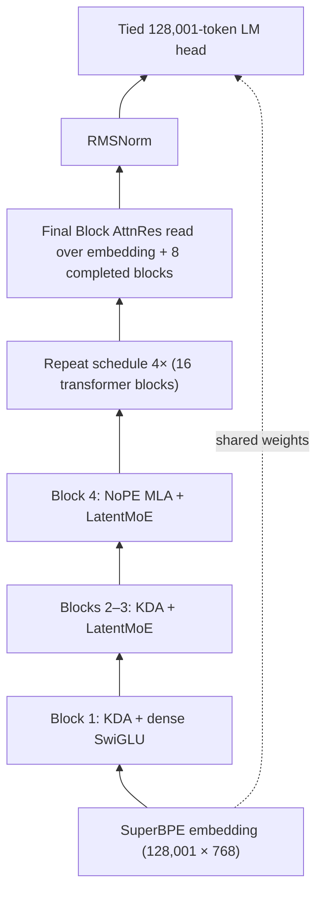

# K3-Inspired Mini-Pretraining System

This repository implements a text-only, public-faithful approximation of the pictured Kimi K3
architecture. It composes the published Kimi Delta Attention (KDA), NoPE MLA, Block Attention
Residuals, and LatentMoE designs without inventing the equations of unreleased K3 components.

The primary JSON profile contains 445,227,336 total parameters and an estimated 179,806,536 active
parameters per token. It has a tied 128,001-token embedding/head, width 768, 16 layers, a repeating
`KDA, KDA, KDA, NoPE MLA` schedule, and a dense first FFN followed by 15 LatentMoE FFNs.



Each attention and FFN output is one AttnRes sublayer. Four sublayers are summed into one AttnRes
block, so 32 sublayers produce eight completed blocks plus the embedding source. Every pseudo-query
is zero-initialized.

## What is implemented

| Component | macOS/CPU/MPS | H100 |
|---|---|---|
| KDA | exact recurrent FP32-state oracle | FLA `chunk_kda`, fused Q/K norm, decay gate, beta, backward |
| KDA short convolution | causal PyTorch depthwise convolution | FLA Triton `ShortConvolution` |
| NoPE MLA | PyTorch SDPA | SDPA FlashAttention backend |
| Block AttnRes | readable depth softmax | FLA fused AttnRes + output RMSNorm, checkpoint level 1 |
| Routed expert MLP | Python expert loop over stacked weights | MegaBlocks permutation + CUDA-count CUTLASS grouped GEMM + fused weighted SwiGLU |
| LM loss | PyTorch cross-entropy | FLA fused linear cross-entropy; full 128K logits are omitted |
| Router | softmax top-4 with balance/z losses; sigmoid no-aux ablation | same |

The default softmax router uses a `0.01` load-balancing coefficient and `0.001` z-loss coefficient.
The selectable `sigmoid_noaux` router uses unbiased mixture weights, selection-only correction bias,
and a `1e-3` correction update. Training logs per-layer expert loads, entropy, dead experts, maximum
load violation, and the longest current dead-expert streak.

K3's Gated MLA, Quantile Balancing, SiTU, Stable LatentMoE changes, QAT, and vision stack are not
implemented because their equations are not public. The relevant modules are isolated behind
interfaces so a published implementation can replace them later.

## Install

The project requires Python 3.11 or 3.12 and is locked with `uv`.

macOS development:

```bash
uv sync --locked
uv run pytest
uv run python test_smoke.py
```

Linux/H100:

```bash
uv sync --locked --extra cuda
uv run k3-mini dry-run --config configs/primary.json --backend h100
uv run k3-mini train --config configs/h100-smoke.json --synthetic
```

The CUDA extra pins these inspected revisions:

- `fla-org/flash-linear-attention@ccb0ff944cbff035fa59ac47a4cc8fd2e079bb17`
- `databricks/megablocks@952db33d6eac334d22c61e47a0d5d41446298784`

`uv` supplies Torch as an explicit build dependency for MegaBlocks and `grouped_gemm`, and sets
`GROUPED_GEMM_CUTLASS=1` specifically for the latter so expert counts can remain CUDA-resident.
Both packages are guarded by Linux x86-64 markers and are not installed into the macOS environment.
Record `nvidia-smi`, driver, CUDA toolkit, GPU model, and the successful backend report when the
target SSH host is available.

## Configuration and commands

The commands consume a JSON file containing typed `model`, `data`, and `train` sections:

```bash
uv run k3-mini dry-run --config configs/primary.json
uv run k3-mini data-inspection --config configs/primary.json --samples 2
uv run k3-mini make-validation --config configs/primary.json
uv run k3-mini train --config configs/primary.json --stage overfit
uv run k3-mini train --config configs/primary.json --stage 10m
uv run torchrun --standalone --nproc_per_node=8 \
  -m k3mini.cli train --config configs/primary.json --stage 1b
```

Resume with the same world size:

```bash
uv run torchrun --standalone --nproc_per_node=8 \
  -m k3mini.cli train --config configs/primary.json --stage 1b --resume latest
```

`--stage overfit` repeats one fixed global batch for 100 updates. `--stage 10m` stops after crossing
10M consumed tokens. `--stage 1b` uses the configured 1B-token target. `--synthetic` replaces
ClimbMix with deterministic random tokens for plumbing tests only.

The default global batch is 262,144 tokens. With one 4,096-token sequence per GPU, gradient
accumulation is derived as `64 / world_size`, which is integral for one through eight GPUs.

## Data path and exact resume

`PackedClimbMixDataset`:

1. opens `OptimalScale/ClimbMix` as a Hugging Face streaming iterable;
2. deterministically shuffles its data sources and a bounded 10,000-row buffer;
3. shards the iterable by DDP rank;
4. consumes only `text` for training and retains `cluster_id` counts for diagnostics;
5. ignores ClimbMix's floating-point, tokenizer-specific `token_count`;
6. hashes documents into a deterministic 0.1% validation split;
7. calls the Rust `tokenizers.Tokenizer.encode_batch` path directly;
8. inserts token 128000 (`<|endoftext|>`) after each document; and
9. emits contiguous 4,097-token chunks as shifted 4,096-token samples without padding.

The validation command materializes only one million validation tokens. A checkpoint contains a
single shared model/optimizer state plus a small rank-local file with Hugging Face iterable state,
the rolling token buffer, RNG state, cluster counters, and resolved tokenizer/dataset commit IDs.
Writes use temporary files followed by atomic replacement and a final `COMPLETE` marker. Exact
resume rejects a changed world size or revision.

## Training defaults

- DDP over one to eight H100s; no expert parallelism.
- BF16 autocast with FP32 parameters and AdamW state; TF32 enabled.
- Activation recomputation for AttnRes/mixer and AttnRes/FFN sublayers.
- AdamW: LR `3e-4`, betas `(0.9, 0.95)`, epsilon `1e-8`, weight decay `0.1`, clip `1.0`.
- No weight decay on norms, biases, KDA decay parameters, or router correction state.
- A 100-update token-based warmup, then cosine decay to `3e-5`.
- Validation every 25M consumed tokens and atomic checkpoints every 50M.

## Profiling and H100 acceptance

Run a full-step and component benchmark:

```bash
uv run k3-mini kernel-benchmark \
  --config configs/primary.json \
  --backend h100 \
  --iterations 10 \
  --trace runs/k3-mini/h100-trace.json \
  --output runs/k3-mini/h100-benchmark.json
```

The report includes the selected KDA, short-convolution, AttnRes, expert, and loss backends; full
step latency; tokens/second; peak CUDA memory; and forward/backward timings for KDA, MLA, LatentMoE,
and nine-source AttnRes.

The H100 expert path keeps routing metadata on-device: MegaBlocks sort/histogram/gather/scatter
kernels perform permutation and unpermutation, CUTLASS grouped GEMM consumes CUDA-resident expert
counts, gate/up projections share one grouped GEMM, and selected router weights are applied to the
SwiGLU activation before the down projection. The KDA output also uses FLA's fused RMSNorm plus
sigmoid gate. Expensive expert-load diagnostics are evaluated only when the trainer logs.

The first verified H100 result for the earlier untied 543M profile is committed in
[`profiles/h100-sm90-2026-07-17.json`](profiles/h100-sm90-2026-07-17.json). On one H100 80GB, the
untied profile measured 366.0 ms and 11,192 tokens/s for a batch of one 4,096-token sequence,
with 4.90GB peak allocated for model forward/backward.

The tied 445M profile and routed-kernel before/after measurements are in
[`profiles/h100-sm90-tied-optimized.json`](profiles/h100-sm90-tied-optimized.json). The optimized
path measured 236.6 ms and 17,313 tokens/s, versus 316.2 ms and 12,952 tokens/s before the routed
changes: 25.2% lower full-step latency, 33.7% higher throughput, and 54.1% lower LatentMoE
forward/backward latency. This is batch one at 4,096 context with one forward/backward microstep,
activation checkpointing, no gradient accumulation, and no `torch.compile`; AdamW and data loading
are excluded.

The KDA, AttnRes, and routed-MoE components can each be captured by a CUDA Graph. Full-step capture
is not enabled because the pinned FLA fused linear cross-entropy computes the non-ignored target
count through a host scalar read. Keeping the memory-efficient 128K loss is preferable to silently
falling back to materialized logits; graphing the complete train step therefore remains gated on a
capture-safe fused-loss patch and DDP/optimizer replay tests.

For one H100, the measured maximum-throughput layout for the planned 262,144-token global batch is
64 sequences per 4,096-token microstep with one accumulation step. The CUDA-synchronized training
entry point sustains 74,093 tokens/second over four post-compilation synthetic AdamW updates,
without `torch.compile`; the isolated CUDA-event update harness measured a conservative 64,492
tokens/second. The absolute capacity probe reached batch 71 with the expandable CUDA allocator,
but it was slower and changes the global batch; batch 72 OOMed at the fused-loss allocation
boundary. Full measurements are in
[`profiles/h100-sm90-max-batch-2026-07-17.json`](profiles/h100-sm90-max-batch-2026-07-17.json).

The same batch-64 layout was also tested with `torch.compile`: it sustained 74,080
tokens/second versus 74,093 eager, a statistically neutral `-0.02%` change. Raising Dynamo's
specialization budget enough to avoid the AttnRes state recompile limit produced 74,026
tokens/second and did not improve the result. The fused external kernels already dominate this
profile, so eager remains the default. A reproducible compiled configuration is provided at
[`configs/h100-batch64-compiled.json`](configs/h100-batch64-compiled.json).

GPU parity tests are opt-in:

```bash
K3MINI_RUN_GPU_TESTS=1 uv run pytest -m gpu
```

They compare FLA KDA and AttnRes outputs/gradients to the reference implementation and compare
grouped-GEMM experts against the reference loop, including an empty expert and a heavily loaded
expert. The target relative-error tolerance is `5e-3` in BF16. The optimized path must pass these
tests and appear in the backend report before a real run starts.

FlashKDA is intentionally not a training dependency: its inspected backend is forward-only and
inference-only. FlashQLA is not substituted for KDA because it implements scalar-gated Gated
DeltaNet rather than KDA's channel-wise decay. If profiling shows FLA KDA is a material full-step
bottleneck, a custom kernel should be considered only after preserving these parity tests and
demonstrating an end-to-end speedup.

## References

- [Kimi Linear / KDA](https://arxiv.org/abs/2510.26692)
- [Block Attention Residuals](https://arxiv.org/abs/2603.15031)
- [LatentMoE](https://arxiv.org/abs/2601.18089)
- [Kimi K3 architecture post](https://www.kimi.com/blog/kimi-k3)
- [FLA fused AttnRes](https://github.com/fla-org/flash-linear-attention/blob/main/fla/ops/attnres/fused.py)
- [Moonshot FlashKDA](https://github.com/MoonshotAI/FlashKDA)
- [Qwen FlashQLA](https://github.com/QwenLM/FlashQLA)
- [SuperBPE 128K tokenizer](https://huggingface.co/alisawuffles/superbpe-tokenizer-128k)
- [OptimalScale ClimbMix](https://huggingface.co/datasets/OptimalScale/ClimbMix)
